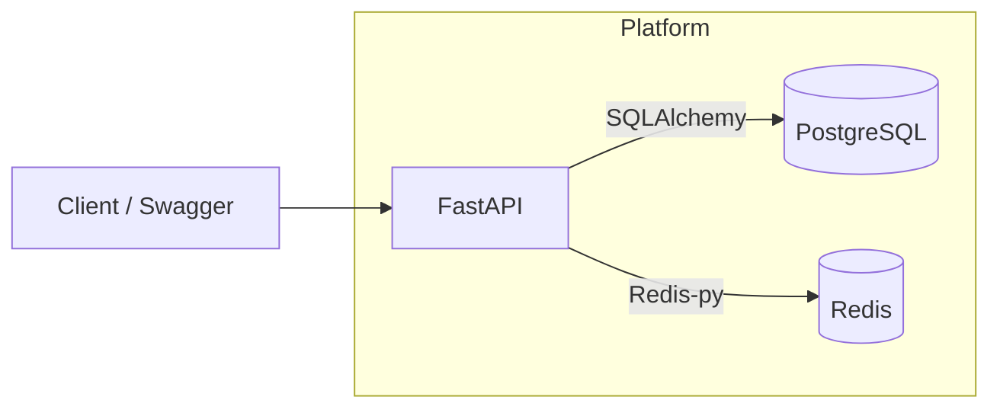

# Evently — Architecture & ERD (Day 1)

## High-level architecture


## ERD (MVP)
```mermaid
erDiagram
    USERS ||--o{ BOOKINGS : makes
    EVENTS ||--o{ BOOKINGS : has
    USERS {
        bigint id PK
        string name
        string email UNIQUE
        string password_hash
        string role
        timestamptz created_at
    }
    EVENTS {
        bigint id PK
        string name
        string venue
        timestamptz start_time
        timestamptz end_time
        int capacity
        int booked_count
        string status
        bigint created_by
        timestamptz created_at
        timestamptz updated_at
    }
    BOOKINGS {
        bigint id PK
        bigint user_id FK
        bigint event_id FK
        int qty
        string status
        string idempotency_key
        timestamptz created_at
    }
```
